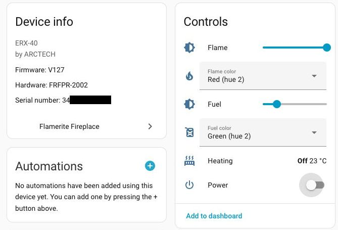

# Flamerite Home Assistant integration

Unofficial HomeAssistant integration for controlling [Flamerite](https://flameritefires.com) fireplaces.

## Supported devices

The integration currently only supports the `NITRAFlame` class of devices.

However, other Flamerite devices that use the eControl app should also be able to work with this integration. Please
open an issue if you have such a device and you wish to help enable support for it.

## Supported features

The following features are supported:

- Turn on/off.
- Select color for flame / fuel.
- Adjust brighness for flame / fuel.
- Adjust thermostat.
- Adjust heat mode (off, on) and fan mode (off, low, high).

**NOTE**: Turning on either the heat or the fan while the fireplace is _off_ will turn it _on_.

Programmable timers are **not** yet supported.

## Installation

### HACS installation

This is the recommended way to install.

1. Search for `flamerite` in [HACS](https://hacs.xyz/).
2. Install.
3. Restart Home Assistant.
4. In the HA UI, click Settings in the left nav bar, then click "Devices & Services". By default you should be viewing the Integrations tab. Click "+ Add Integration" button at bottom right and then search for `flamerite`.

### Manual Installation

1. Using the tool of choice open the directory (folder) for your HA configuration (where you find `configuration.yaml`).
2. If you do not have a `custom_components` directory (folder) there, you need to create it.
3. In the `custom_components` directory (folder) create a new folder called `flamerite`.
4. Download _all_ the files from the `custom_components/flamerite/` directory (folder) in this repository.
5. Place the files you downloaded in the new directory (folder) you created.
6. Restart Home Assistant.
7. In the HA UI, click Settings in the left nav bar, then click "Devices & Services". By default you should be viewing the Integrations tab. Click "+ Add Integration" button at bottom right and then search for `flamerite`.

## Adding supported devices to Home Assistant

Once the integration is installed, Home Assistant should be able to automatically detect compatible devices based on
bluetooth advertisment data and prompt you to configure them.

The last step of the configuration flow requires manual pairing of the fireplace to the Home Assistant bluetooth device
that detected it. To complete the pairing process, you need to press the physical link button at the device control panel.

**NOTE**: the integration maintains a persistent bluetooth connection to each fireplace device. While connected, you will not
be able to control the device via the eControl application. Control via the RF remote works as expected and any changes made
via the RF remote will be reflected within Home Assistant.
